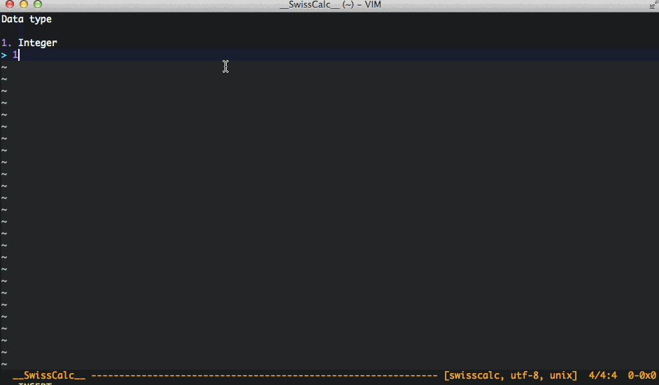
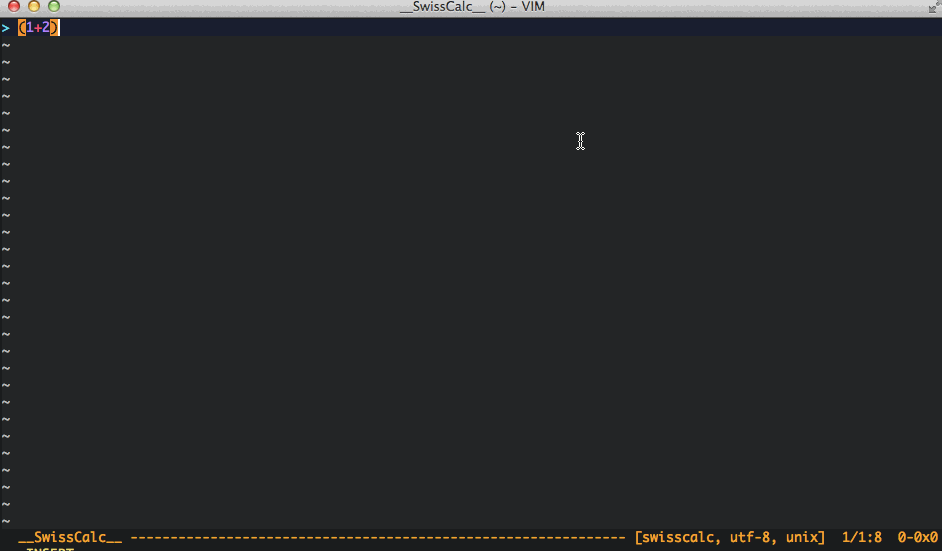
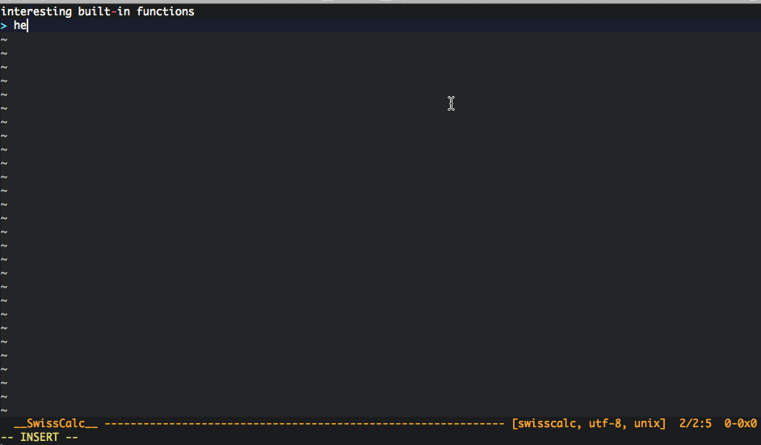
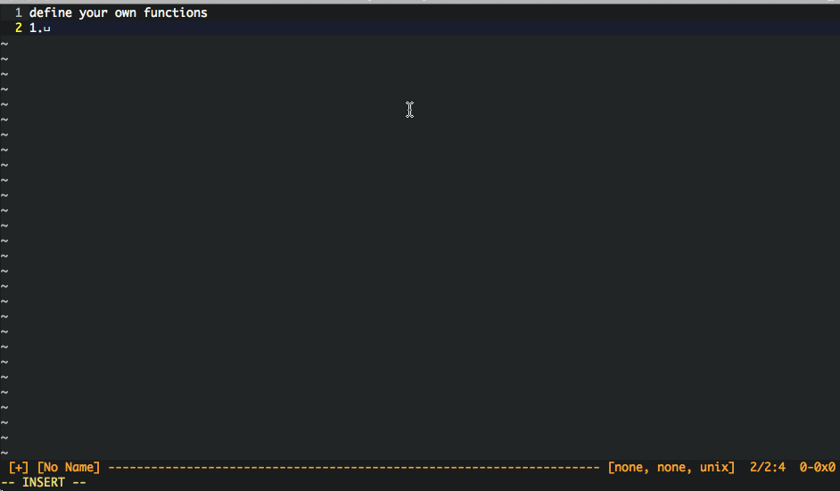
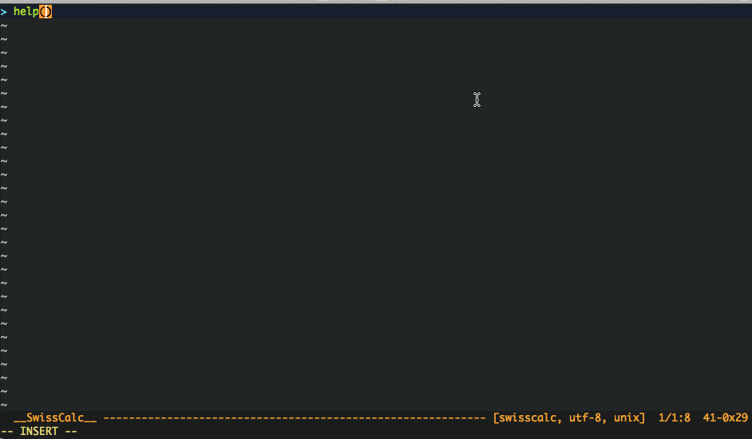

如果你能阅读中文，请在Vim中打开doc/swisscalc.txt阅读帮助文档。

# Introduction

SwissCalc is a powerful interactive calculator for programmer whilst inside Vim.
SwissCalc wants to achieve two goals:

1. convenient
2. powerful

SwissCalc preserve as mush Vim functionality as possible. You can edit, move,
edit, yank expressions for SwissCalc by Vim. It's quite easy to open SwissCalc
and edit expressions in Vim. SwissCalc has been tailored to act as a Read Eval
Print Loop (REPL) and provides some convenient variables such as last evaluated
result, pi, e and functions such as vars(), funcs(), help().

SwissCalc supports three data types: integer, float, string(yes, I am serious).
SwissCalc also provides many operations such as bitwise operation, exponention,
factorial. SwissCalc is supplied many built-in functions, too. You can all many
math functions such as log(), sqrt(), sin(), asin(), many string functions to
manipulate string, for example base64 encoding/decoding, md5/sha digest, regular
expression, url encoding/decoding, time operattion. If you find that SwissCalc
is missing functions that you would like to use, you can define your own
functions easily by Python.

# Installation

## Requirements

1. Vim 7.0+ with +python.
2. Python 2.7 installed.

SwissCalc supports Linux, Mac OS X and Windows.

## Installation

Download the latest source from https://github.com/lightxue/SwissCalc

Extract (or copy) all of the files into your Vim runtime directory, ensuring
that they are placed into the correct subdirectories.

# Usage

Type `:ScalcSplit` to open a new window containing the SwissCalc buffer(other
open commands: `:Scalc`, `:ScalcVSplit`, `:ScalcTab`). SwissCalc closed when
all SwissCalc buffer closed.SwissCalc has been tailored to act as a Read Eval
Print Loop (REPL). That is, any command read at the prompt will be evaluated
after you press `<CR>` and the result printed back to you interactively.

# Data types

SwissCalc support three data types: integer, float and string. Integer is not
arbitrary size, see `Environment variable`. Floating-point arithmetic is
IEEE754, which means float evaluation is not arbitrary precision.

# Operations

    Precedence  Operator   Associativity  Description
    0           =          right          Assignment
    0           += -=      right          Assignment by sum and difference.
    0           *= /=      right          Assignment by multiply and division.
    0           %= **=     right          Assignment by modulus and exponent.
    0           <<= >>=    right          Assignment by Arithmethc left and
                                          right shift.
    0           &= |= ^=   right          Assignment by bitwise(and, or, xor).
    1           & | ^      left           Bitwise (and, or, xor).
    2           << >>      left           Arithmetic left and right shift.
    3           + =        left           Addition and subtraction.
    4           * / %      left           Multiplication, division and modulus.
    5           !          right          Factorial.
    6           **         left           Exponentiation.

# Variables

You will find it is convenient to define variables when expression is
complicated. SwissCalc will define a variable when you assign it. All
variables are in the same global scope. That is all variables bound to a value
until SwissCalc exit.

There are some built-in variables in SwissCalc.

    Variable    Description
    _           Last evaluated result.
    e           Euler's number.
    pi          Ratio of any circle's circumference to its diameter in
                Euclidean space.
    phi         Golden ratio. Useful when working with Fibonacci sequences.

# Functions

## Built-in functions

SwissCalc is supplied with many built-in functions. Here are some of them.

    Function      Description

    help          Print document of the function

    ff            Search functions(built-in and user-defined) by regular
                  expression key. Print the Search result.

    funcs         Displays a list of all of the functions SwissCalc supported,
                  including built-in functions and user-defined functions.

    vars          Displays a list of all of the currently bound variables and
                  their assigned value.

    env           Displays a list of all of the environment variables and their
                  value.

    setenv        Set environment variable. It toggle value if value is not
                  given.

    int           Convent other data type to integer. When converting a string,
                  use the optional base.

    float         Convert other data type to float.

    str           Convert other data type to string.

## User-defined functions

Define functions for SwissCalc is quite easy. Add all the functions you want to
`autoload/custom.py`. They will be loaded when the SwissCalc buffer created.

There are something you should know before defining your own functions:

1. Functions should be writed by Python.
2. All parameters and return values should be integer, float or string.
3. Strong recommend writing function's docstring, so you can get help by help().
4. Everything send to stdout will redirect to the SwissCalc buffer, but stderr
   will not.
5. User-defined functions will overwrite built-in functions if they have the
   same name.
6. Raising exceptions is valid because SwissCalc will catch all user-define
   exceptins.

If you do add functions that you think others would benefit from,
please send me patches.

# Environment variables

You can adjust SwissCalc by environment variables. Environment variables are
bound to different scope with user-defined variables, so don't worry your
variables will overwrite environment variables when they have the same name.

    Variables    Defualt   Description
    bin          0         Whether display binary mode when print integer.
    oct          0         Whether display octal mode when print integer.
    dec          1         Whether display decimal mode when print integer.
    hex          0         Whether display hexadecimal mode when print integer.
    word         8         Number of bytes that handling integer.
    signed       1         Whether integer is signed.

# Commands

1. :Scalc        ==> open SwissCalc in a current window
2. :ScalcSplit   ==> open SwissCalc in a horizontal window
3. :ScalcVSplit  ==> open SwissCalc in a vertical window
4. :ScalcTab     ==> open SwissCalc in a new tab

# Change log

    Version   Time           Description
    1.0.0     2013-12-07     First release, hope you like it.
    0.9.0     2013-11-18     Beta version.

# About

Author;  Light Xue 
Email:   bkmgtp@gmail.com 
Website: https://github.com/lightxue/SwissCalc

Contributing to SwissCalc couldn't be easier. If you wish to do development
work on the code base or documentation simply fork the git repository and submit
a pull request to me. If you discover a bug or wish to submit a feature request
add an issue to the github page. Anything else, feel free to email me.

Bugs, suggestions and patches are all very welcome. If you find issues with
VimCalc please add them to the issues page on the github project.

Check out the latest from github at https://github.com/lightxue/SwissCalc

Thanks to below people

    name                   Reasion
    Guido van Rossum       My whole world the simpler and more beautiful
                           because of Python.
    Bram Moolenaar         Thank your for your Vim which makes me enjoy coding.
    David Beazley          Your PLY makes SwissCalc simpler and better.
    Greg Sexton            SwissCalc would not exist without VimCalc.

# License

SwissCalc is released under the GPLv3.
See http://gplv3.fsf.org/
